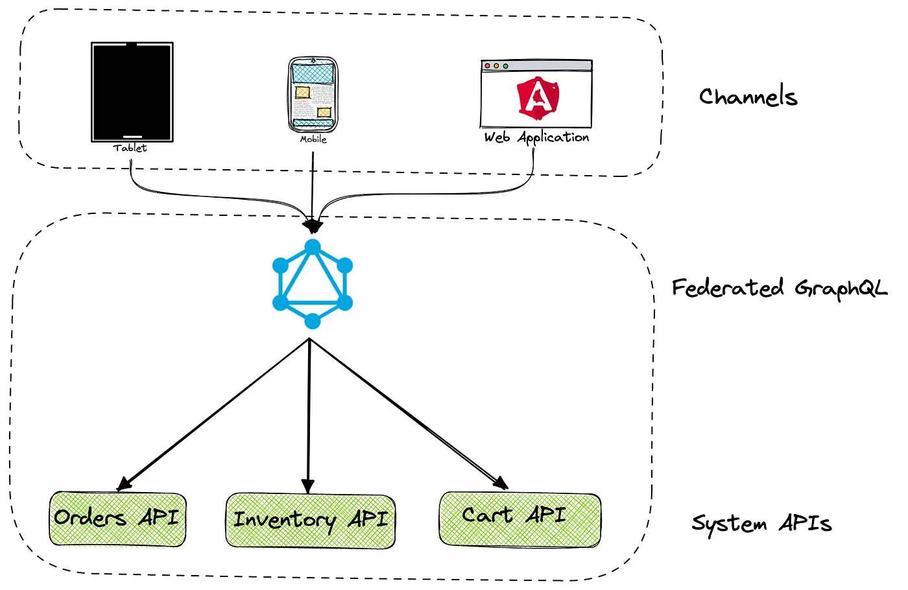
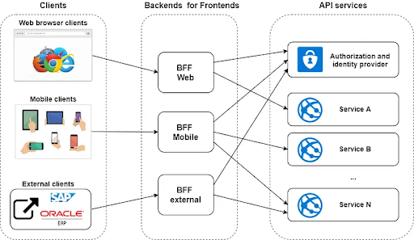

# 1. Graphql 101

- [1. Graphql 101](#1-graphql-101)
  - [1.1. From the get go](#11-from-the-get-go)
  - [1.2. Overview](#12-overview)
    - [1.2.1. (Partial) Language Overview](#121-partial-language-overview)
    - [1.2.2. Fields and Field Resolvers](#122-fields-and-field-resolvers)
    - [1.2.3. Fragments](#123-fragments)
  - [1.3. Architecture Examples](#13-architecture-examples)
    - [1.3.1. Authentication](#131-authentication)
    - [1.3.2. Performance vs REST](#132-performance-vs-rest)
  - [1.4. Instrospection](#14-instrospection)
  - [1.5. Sources](#15-sources)

## 1.1. From the get go

- graphql is a **communication standard**
- graphql is not a programing language
- objective:
  > "...for **describing** the capabilities and requirements
  > of data models for client-server applications"
- **self-documented**:
  >Ensure that all of your data is statically typed and these types inform what queries the schema supports.
- **included deprecation mechanism**
  > Reduce the need for breaking changes, but utilize a built-in mechanism for deprecations when you need to.
- **data source Agnostic**
"GraphQL does not mandate a particular programming language or storage system for application services that implement it"
- **you get what you ask for**:
  - GraphQL queries are **Field Sets**
  - field -> function **field resolver**

GraphQL **principles**:

1. Product-centric: ***GraphQL is unapologetically driven by the requirements of views and the front-end engineers that write them***.  
    - "Client First", me, 2023
    - >"designed to build client applications by providing an intuitive and flexible syntax and system for describing their data requirements and interactions."
    GraphQL Spec, 2021
2. Hierarchical
3. Strong-typing
4. Client-specified response
5. Introspective

## 1.2. Overview

Its just HTTPS, auth whatever you like, client and server interact throught POST json body:

- query: a read-only fetch.

    ```graphql
    type Query {
        books: [Book!]!
    }
    query GetBooks {
      books {
          title
          author
      }
    }
    ```

- mutation:  a write followed by a fetch.

    ```graphql
    mutation {
        likeStory(storyID: 12345) {
            story {
                likeCount
            }
        }
    }
    ```

- subscription: a long-lived request that fetches data in response to source events.
  - web sockets generally used
  - supports EventDriven archs

### 1.2.1. (Partial) Language Overview

For completeness, check <a href="#graphql_arch_article2">the GraphQL Spec Document</a>.

- type

    ```graphql
    type Person {
        name: String
        birthdate: Date
        picture: Url
    }
    ```

- interface

    ```graphql
    
    interface Person {
        name: String!
        birthdate: Date!
        picture: Url
    }
    type Book {
        title: String!
        author: Author!
        publication_date: Date!
    }
    type Author implements Person {
        name: String!
        birthdate: Date!
        picture: Url
        books: [Book]
    }
    ```

- union

    ```graphql
    union SearchResult = Book | Author

    ```

- enum

    ```graphql
    enum CardinalDirection {
      NORTH
      EAST
      SOUTH
      WEST
    }
    ```

- non-null: `name: String!`

- Field Arguments

    ```graphql
    type Person {
        name: String
        picture(size: Int):  
    }
    {
        name
        picture(size: 600)
    }
    ```

- input objects:

    ```graphql
      input Point2D {
        x: Float
        y: Float
      }

      {
        closestBathrooms(from: Point2D): [Bathroom]
      }
    ```

### 1.2.2. Fields and Field Resolvers

- [Selection Set](https://github.com/graphql/graphql-spec/blob/51337a9b820e296fa7d03ae77d534cb4b247c201/spec/Section%202%20--%20Language.md?plain=1#L326)

- [Field Alias](https://github.com/graphql/graphql-spec/blob/51337a9b820e296fa7d03ae77d534cb4b247c201/spec/Section%202%20--%20Language.md?plain=1#L463)

____

### 1.2.3. Fragments

- primary unit of composition
- recycle and reuse common pieces of queries
- inline fragments ???

  ```graphql
  type User {
    # a bunch of fields...
  }
  type Adress {
    # like 100 fields, i know, crazy.
  }

  fragment friendFields on User {
    id
    name
    profilePic(size: 50)
  }

  fragment simpleAddress on Address {
    line1
    line2
    city
    country
  }

  # QUERY:
  {
    user(id: "4") {
      friends(first: 10) {
        ...friendFields
        address {
          ...simpleAddress
        }
      }
      mutualFriends(first: 10) {
        ...friendFields
        address {
          ...simpleAddress
        }
      }
    }
  }
      
  ```

## 1.3. Architecture Examples

<figure>
    
    <figcaption>
    GraphQL server and db in same vm serving mobile and web clients [<a href="#graphql_spec">1</a>]
    </figcaption>
</figure>

<figure>
    
    <figcaption>
    graphql server in dedicated 'orchestator' node in microservice arch with 3 different data sources [<a href="#graphql_arch_article2">3</a>]
    </figcaption>
</figure>

<figure>
    
    <figcaption>
    graphql server  with db in same vm while also orchestrating with two external data sources [<a href="#graphql_arch_article2">3</a>]
    </figcaption>
</figure>

<figure>
    
    <figcaption>
    GraphQL Api Gateway example[<a href="#graphql_arch_article2">3</a>]
    </figcaption>
</figure>

<figure>
    
    <figcaption>
    Backend For Frontend
    </figcaption>
</figure>

### 1.3.1. Authentication

A secure Server has some sort of Authentication:

- Basic Auth: base64(user:password) (just dont use this)
    `curl --header "Authorization: Basic am9objpzZWNyZXQ=" my-website.com`
- Bearer Tokens:
  - JSON Web Tokens (JWT, normal RSA in payload + signature), header , payload + signature
  - OAuth 2.0: 1 Authorization (email+pass, 3rdP Identity Provider) then Bearer is Session token.

<figure>
    
    <figcaption>
      An Authentication Layer in front of the GraphQL service.
    </figcaption>
</figure>

### 1.3.2. Performance vs REST

- 1 field -> 1 resolver function
- data batching on  the server in stead of client -> less http calls for same data
- catered query for client -> allows for mutiple different clients, same endpoint fullfills different needs

performance improvements in frontend:


## 1.4. Instrospection

```graphql
{
  __type(name: "Book") {
    name
    fields {
      name
      type {
        name
        kind
      }
    }
  }
}
```

```json

```

## 1.5. Sources

- <a id='graphql_spec'>[GraphQL Spec October2021](https://spec.graphql.org/October2021/)</a>
- <a id='graphql.org'>[graphql.org](https://graphql.org/learn)
- <a id='graphql_arch_article1'>[howtographql.com: Big Picture (Architecture)](https://www.howtographql.com/basics/3-big-picture/>)</a>
- <a id='graphql_arch_article2'>[Solution Architects Guide to GraphQL](https://servian.dev/solution-architects-guide-to-graphql-2d513316e424)</a>
- <a id='graphql_intro'>[Introduction to GraphQL](https://graphql.org/learn/)</a>
- <a id='graphql-arch-patterns'>[GraphQL-based Architecture Patterns](https://chanakaudaya.medium.com/graphql-based-solution-architecture-patterns-8905de6ff87e)
- [GraphQL.org: Instrospection](https://graphql.org/learn/introspection/)
- [Apollo Server: Union and Interfaces](https://www.apollographql.com/docs/apollo-server/schema/unions-interfaces/)
- [12 Microservices Patterns I Wish I Knew Before the System Design Interview](https://levelup.gitconnected.com/12-microservices-pattern-i-wish-i-knew-before-the-system-design-interview-5c35919f16a2)
