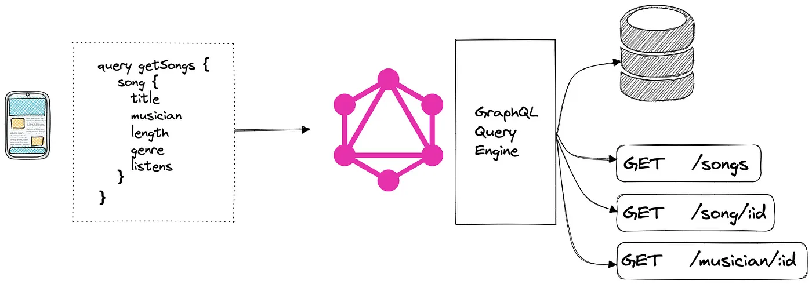

#7ujIntro to Graphql

## From the get go

- graphql is a **communication standard**
- graphql is not a programing language
- objective:
  > "...for **describing** the capabilities and requirements
  > of data models for client-server applications"
- **self-documented**:
  >Ensure that all of your data is statically typed and these types inform what queries the schema supports.
- **included deprecation mechanism**
  > Reduce the need for breaking changes, but utilize a built-in mechanism for deprecations when you need to.
- **data source Agnostic**
"GraphQL does not mandate a particular programming language or storage system for application services that implement it"
- **you get what you ask for**:
    - GraphQL queries are **Field Sets**
    - field -> function **field resolver**

GraphQL **principles**:

1. Product-centric: ***GraphQL is unapologetically driven by the requirements of views and the front-end engineers that write them***.  
    - "Client First", me, 2023
    - "designed to build client applications by providing an intuitive and flexible syntax and system for describing their data requirements and interactions.", GraphQL Spec, 2021
2. Hierarchical
3. Strong-typing
4. Client-specified response
5. Introspective

## Architecture

<figure>
    
    <figcaption>
    GraphQL server and db in same vm serving mobile and web clients [<a href="#graphql_spec">1</a>]
    </figcaption>
</figure>

<figure>
    
    <figcaption>
    graphql server in dedicated 'orchestator' node in microservice arch with 3 different data sources [<a href="#graphql_arch_article2">3</a>]
    </figcaption>
</figure>

<figure>
    
    <figcaption>
    graphql server  with db in same vm while also orchestrating with two external data sources [<a href="#graphql_arch_article2">3</a>]
    </figcaption>
</figure>

### Authentication?

- TODO elaborate

<figure>
    
    <figcaption>
     [<a href="TODO">5</a>]
    </figcaption>
</figure>
~~ææ~~
### Stitching

TODO elaborate

- [](https://the-guild.dev/graphql/stitching)
- [](https://www.apollographql.com/blog/backend/graphql-schema-stitching/)

## Performance

Dado que:

- ~~1 field -> ææ1 resolver function~~
- data batching on  the server in stead of client -> less http calls for same data
- catered query for client -> allows for mutiple different clients, same endpoint fullfills different needs

Entonces: ==>
performance improvements in frontend:




____
if
> repeatedly load data from your database.

Then,
> implement batching technique or DataLoader.
____

## Language

Schema Definition:

- type

    ```graphql
    type Person {
        name: String
        age: Int
        picture: Url
    }
    ```

- interface

    ```graphql
    interface Book {
        title: String!
        author: Author!
    }
    type Textbook implements Book {
        title: String! # Must be present
        author: Author! # Must be present
        courses: [Course!]!
    }
    ```

- union

    ```graphql
    union SearchResult = Book | Author

    type Query {
        search(contains: String): [SearchResult!]
    }

    query GetSearchResults {
        search(contains: "Shakespeare") {
            __typename
            ... on Book {
            title
            }
            ... on Author {
            name
            }
        }
    }
    ```

    ```json
    {
        "data": {
            "search": [
            {
                "__typename": "Book",
                "title": "The Complete Works of William Shakespeare"
            },
            {
                "__typename": "Author",
                "name": "William Shakespeare"
            }
            ]
        }
    }
    ```

- enum

    ```graphql
    enum CardinalDirection {
    NORTH
    EAST
    SOUTH
    WEST
    }
    ```

- input objects

- non-null
    ``` name: String! ``

- Field Arguments

    ```graphql
    type Person {
        name: String
        picture(size: Int):  
    }
    {
        name
        picture(size: 600)
    }
    ```

- query: a read-only fetch.

    ```graphql
    type Query {
        books: [Book!]!
        }
        query GetBooks {
        books {
            title
            author
        }
    }
    ```

- mutation:  a write followed by a fetch.

    ```graphql
    mutation {
        likeStory(storyID: 12345) {
            story {
                likeCount
            }
        }
    }
    mutation {
        sendEmail(message: "Hello,\n  World!\n")
    }
    ```

- subscription: a long-lived request that fetches data in response to source events.
    - web sockets
    - support for EDD

#### Fields and Field Resolvers

- [Selection Set](https://github.com/graphql/graphql-spec/blob/51337a9b820e296fa7d03ae77d534cb4b247c201/spec/Section%202%20--%20Language.md?plain=1#L326)

- [Field Alias](https://github.com/graphql/graphql-spec/blob/51337a9b820e296fa7d03ae77d534cb4b247c201/spec/Section%202%20--%20Language.md?plain=1#L463)

____

### Fragments

- primary unit of composition
- recycle and reuse common pieces of queries
- inline fragments ???

```graphql
query withFragments {
  user(id: 4) {
    friends(first: 10) {
      ...friendFields
    }
    mutualFriends(first: 10) {
      ...friendFields
    }
  }
}

fragment friendFields on User {
  id
  name
  profilePic(size: 50)
}
```

## Instrospection

```
{
  __type(name: "Droid") {
    name
    fields {
      name
      type {
        name
        kind
      }
    }
  }
}
{
  "data": {
    "__type": {
      "name": "Droid",
      "fields": [
        {
          "name": "id",
          "type": {
            "name": null,
            "kind": "NON_NULL"
          }
        },
        {
          "name": "name",
          "type": {
            "name": null,
            "kind": "NON_NULL"
          }
        },
        {
          "name": "friends",
          "type": {
            "name": null,
            "kind": "LIST"
          }
        },
        {
          "name": "friendsConnection",
          "type": {
            "name": null,
            "kind": "NON_NULL"
          }
        },
        {
          "name": "appearsIn",
          "type": {
            "name": null,
            "kind": "NON_NULL"
          }
        },
        {
          "name": "primaryFunction",
          "type": {
            "name": "String",
            "kind": "SCALAR"
          }
        }
      ]
    }
  }
}
```

## Sources

1. <a id='graphql_spec'>[GraphQL Spec October2021](https://spec.graphql.org/October2021/)</a>
2. <a id='graphql_arch_article1'>[howtographql.com: Big Picture (Architecture)](https://www.howtographql.com/basics/3-big-picture/>)</a>
3. <a id='graphql_arch_article2'>[Solution Architects Guide to GraphQL](https://servian.dev/solution-architects-guide-to-graphql-2d513316e424)</a>
4. <a id='graphql_intro'>[Introduction to GraphQL](https://graphql.org/learn/)</a>
5. https://chanakaudaya.medium.com/graphql-based-solution-architecture-patterns-8905de6ff87e
6. [GraphQL.org: Instrospection](https://graphql.org/learn/introspection/)
7. [Apollo Server: Union and Interfaces](https://www.apollographql.com/docs/apollo-server/schema/unions-interfaces/)
8. [12 Microservices Patterns I Wish I Knew Before the System Design Interview](https://levelup.gitconnected.com/12-microservices-pattern-i-wish-i-knew-before-the-system-design-interview-5c35919f16a2)
